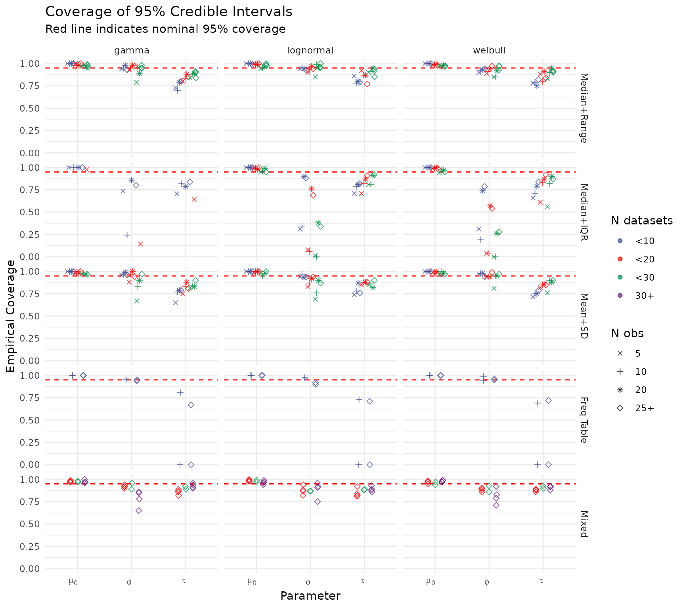
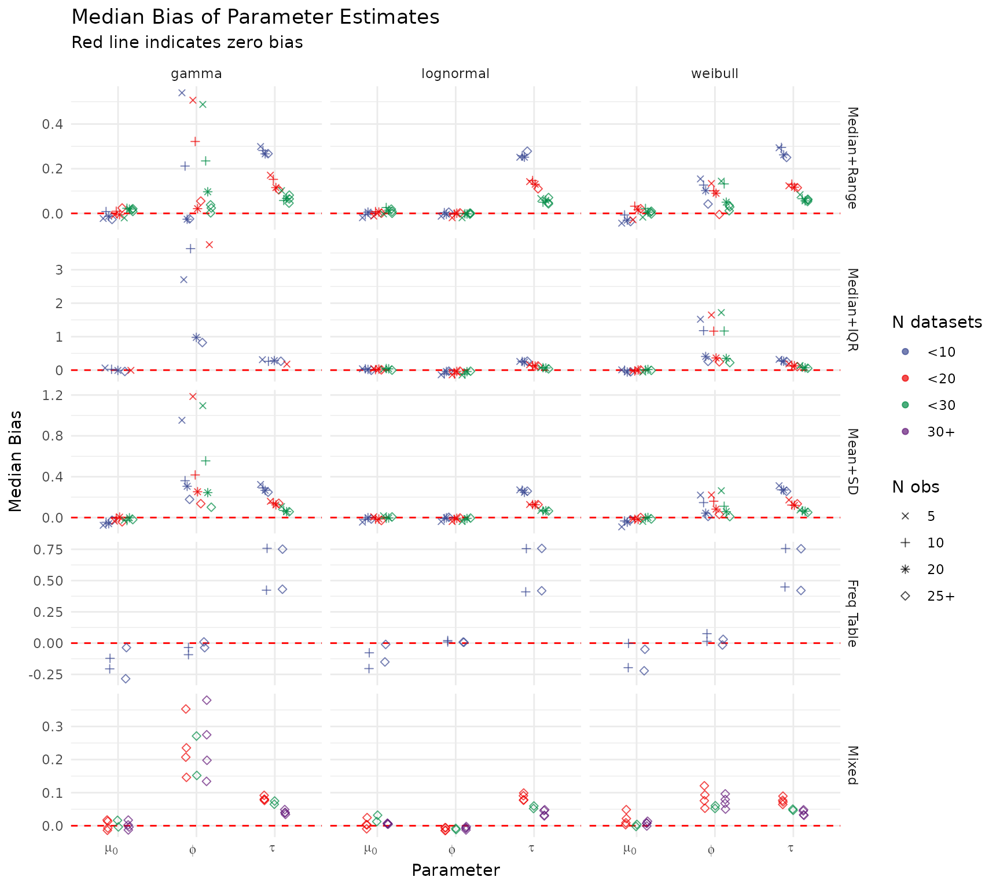
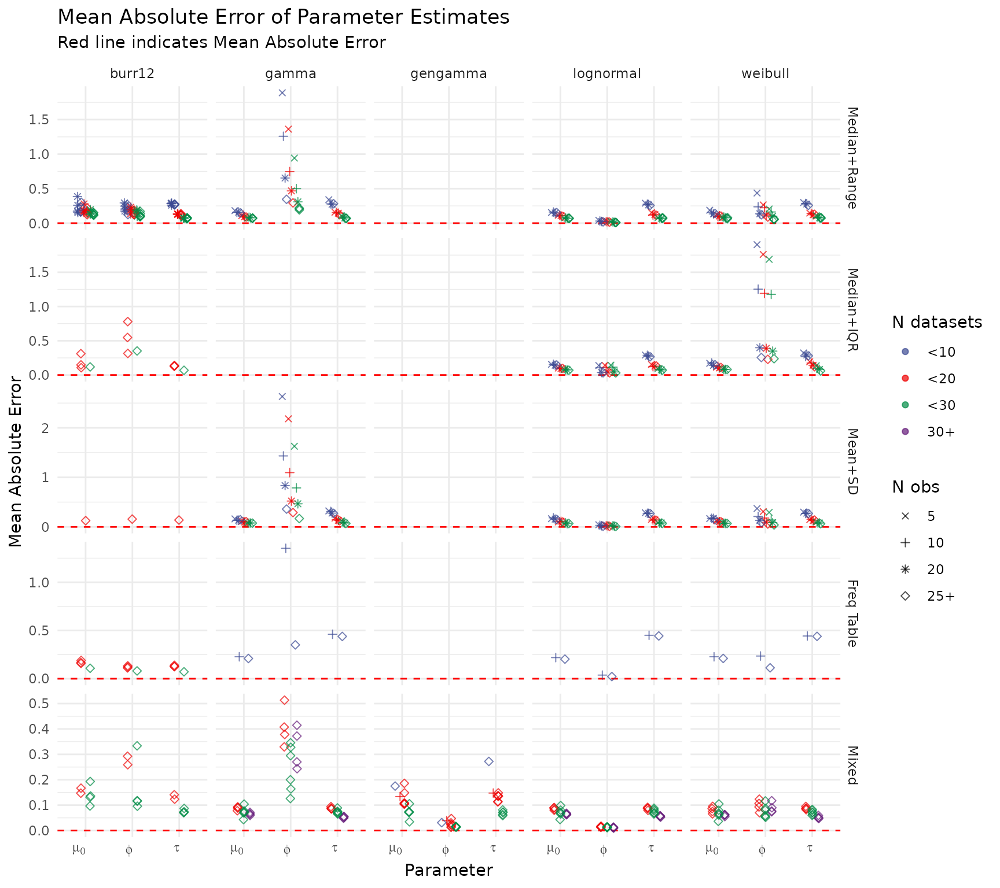
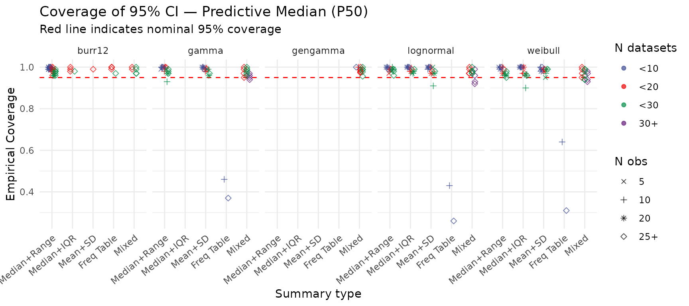
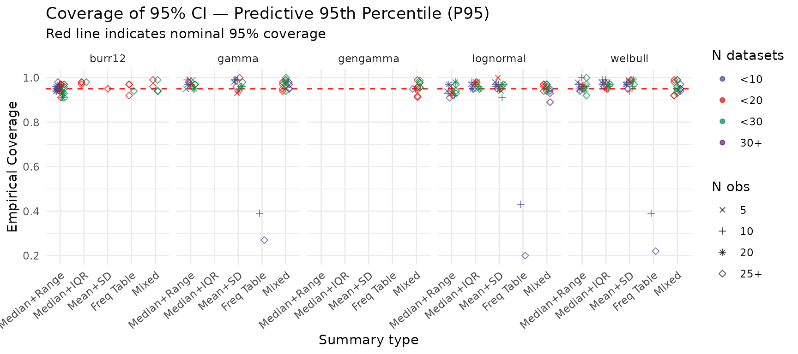
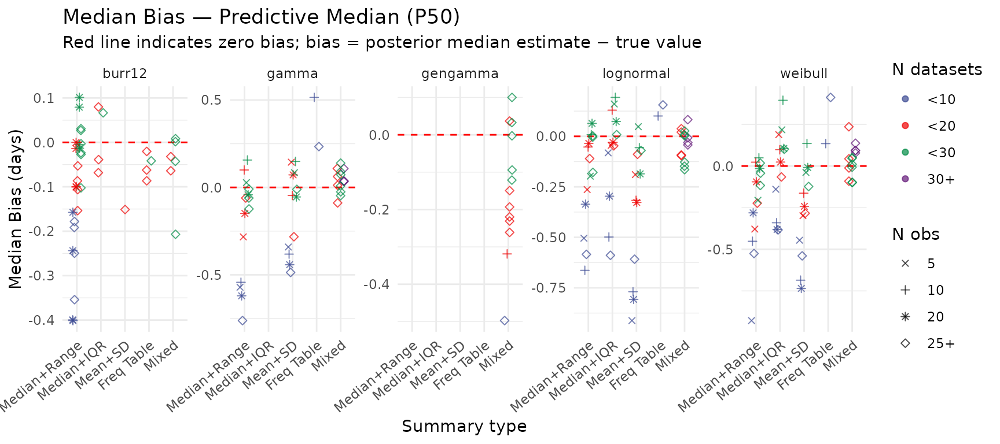
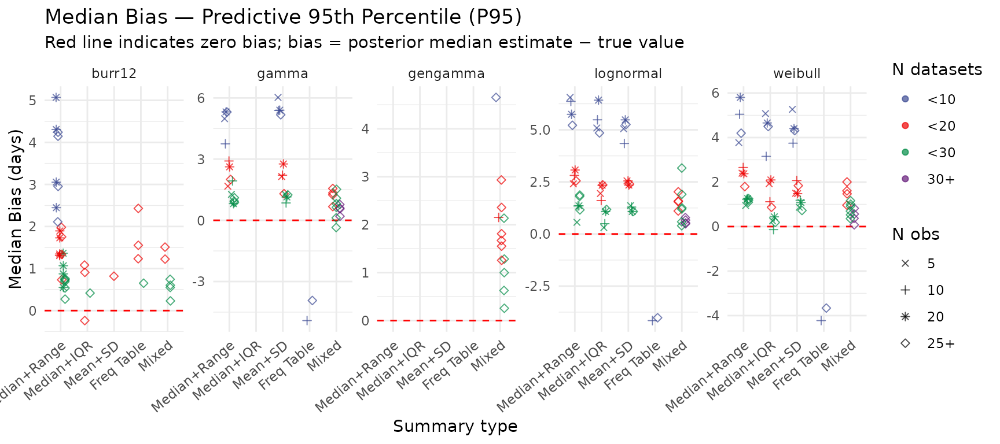
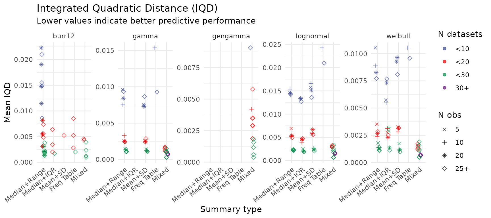
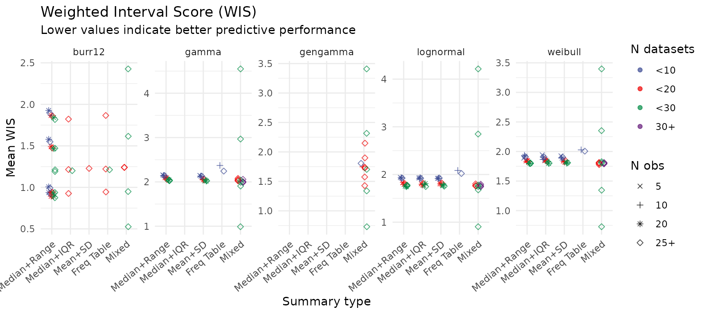
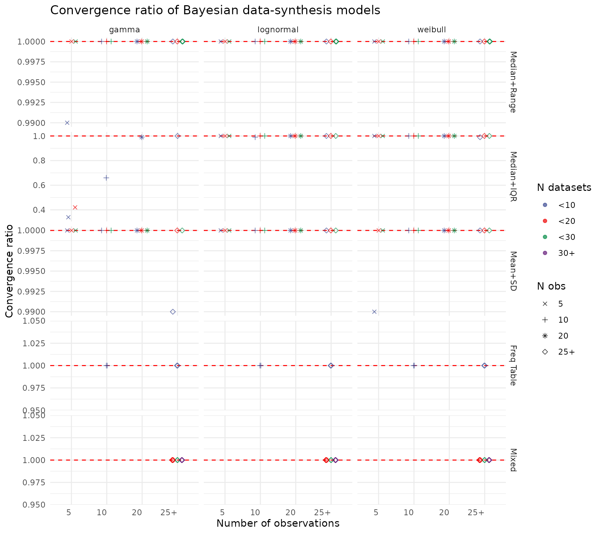

# Simulation Study: Evaluating the Hierarchical Bayesian Model

## Overview

This vignette evaluates the performance of the hierarchical Bayesian
model across a wide range of simulated scenarios. The study examines how
well the model recovers the true population parameters ($`\mu_0`$,
$`\tau`$, $`\phi`$) when individual observations are unavailable and
only summary statistics are reported.

Three standard parametric families are considered — **log-normal**,
**Gamma**, and **Weibull** — along with two extended families: **Burr
XII** and **Generalised Gamma** (GG). Five summary-statistic types are
evaluated:

| `summary_type` | Fields reported                       |
|----------------|---------------------------------------|
| 1              | Median + range (min, max)             |
| 2              | Median + IQR (Q1, Q3)                 |
| 3              | Mean + SD                             |
| 4              | Frequency table (rounded counts)      |
| 5              | Mixed (multiple types across studies) |

> **Note on Generalised Gamma identifiability.** The GG distribution has
> three parameters ($`\mu_0`$, $`\phi`$, $`\kappa`$). In a hierarchical
> synthesis setting, certain combinations of summary-statistic types and
> sample sizes render the shape parameter $`\kappa`$ weakly identified.
> Scenarios flagged by the `gg_heuristic` rule are excluded from the
> summaries below; only scenarios where GG was judged estimable are
> retained.

Performance is assessed via:

- **Credible-interval coverage** — empirical 95% CI coverage for model
  parameters ($`\mu_0`$, $`\tau`$, $`\phi`$) and for two predictive
  quantiles (P50, P95); nominal target: 0.95.
- **Median bias** — median of (posterior median $`-`$ true value) across
  replicates for parameters and predictive quantiles; target: 0.
- **Mean absolute error (MAE)** — for model parameters.
- **Integrated quadratic distance (IQD)** and **Weighted Interval Score
  (WIS)** — measures of predictive distribution accuracy; lower is
  better.
- **MCMC convergence rates** — proportion of replicates with
  $`\hat{R} < 1.05`$.

## Setup

``` r

library(ddsynth)
library(tidyverse)
#> ── Attaching core tidyverse packages ──────────────────────── tidyverse 2.0.0 ──
#> ✔ dplyr     1.2.1     ✔ readr     2.2.0
#> ✔ forcats   1.0.1     ✔ stringr   1.6.0
#> ✔ ggplot2   4.0.3     ✔ tibble    3.3.1
#> ✔ lubridate 1.9.5     ✔ tidyr     1.3.2
#> ✔ purrr     1.2.2     
#> ── Conflicts ────────────────────────────────────────── tidyverse_conflicts() ──
#> ✖ dplyr::filter() masks stats::filter()
#> ✖ dplyr::lag()    masks stats::lag()
#> ℹ Use the conflicted package (<http://conflicted.r-lib.org/>) to force all conflicts to become errors
library(ggsci)
library(here)        # used only for inst/extdata path resolution below
#> here() starts at /home/runner/work/ddsynth/ddsynth
```

## Load Pre-computed Results

Running the full simulation study is computationally intensive. The
results used here were generated by `analysis/new_simulation_study.R`
and saved to disk. All scenario metadata (distribution family, summary
type, sample sizes, true parameters) is embedded directly in the results
file — no separate scenario library is needed.

``` r

# Resolve path: prefer the installed-package location; fall back to the
# vignettes/ source file which is tracked in git and available during
# pkgdown / R CMD build vignette builds.
rds_path <- system.file("extdata", "simulation_results_all.rds", package = "ddsynth")
if (!nzchar(rds_path)) {
  rds_path <- file.path(here(), "vignettes", "simulation_results_all.rds")
}
has_results <- file.exists(rds_path)
if (!has_results) {
  message("simulation_results_all.rds not found; skipping analysis chunks.")
} else {
  res_out <- readRDS(rds_path)
  cat(sprintf("Loaded %d simulation rows across %d unique scenarios.\n",
              nrow(res_out), length(unique(res_out$scenario_name))))
  cat(sprintf("Distribution families: %s\n",
              paste(sort(unique(res_out$dist_type)), collapse = ", ")))
  n_skipped <- sum(!is.na(res_out$skipped_reason))
  if (n_skipped > 0L)
    cat(sprintf("Note: %d rows excluded as non-identifiable (skipped_reason = '%s').\n",
                n_skipped, unique(na.omit(res_out$skipped_reason))))
}
#> Loaded 21900 simulation rows across 219 unique scenarios.
#> Distribution families: burr12, gamma, gengamma, lognormal, weibull
#> Note: 1060 rows excluded as non-identifiable (skipped_reason = 'gg_heuristic').
```

## Summarise Results

`create_results_summary()` aggregates per-replicate outputs, restricting
to converged, estimable runs. The resulting table contains, for each
scenario:

- **Coverage** — empirical 95% CI coverage for $`\mu_0`$, $`\tau`$,
  $`\phi`$, and the predictive median (P50) and 95th percentile (P95).
- **Median bias** — median of (posterior median $`-`$ true value) for
  parameters and predictive quantiles.
- **MAE** — mean absolute error for parameters.
- **IQD** and **WIS** — mean predictive scoring rules across replicates.

``` r

summary_res <- create_results_summary(res_out)
cat(sprintf("Summary covers %d scenario-level rows.\n", nrow(summary_res)))
#> Summary covers 204 scenario-level rows.
```

## Coverage of 95% Credible Intervals — Model Parameters

Each point represents one scenario. Points near the dashed red line
(0.95) indicate well-calibrated uncertainty quantification. Points are
coloured by the number of datasets and shaped by the within-study sample
size.

``` r

create_coverage_plot(summary_res)
```



## Median Bias — Model Parameters

The dashed red line at zero indicates unbiased estimation. Systematic
departures from zero suggest that certain data configurations (e.g.,
very small $`n`$ or sparse summary types) introduce recoverable or
persistent bias.

``` r

create_bias_plot(summary_res)
```



## Mean Absolute Error — Model Parameters

MAE captures the magnitude of estimation error irrespective of
direction. Smaller values across larger datasets and richer summary
types confirm that pooling information across studies reduces estimation
uncertainty.

``` r

create_mae_plot(summary_res)
```



## Coverage of 95% Credible Intervals — Predictive Median (P50)

Coverage for the posterior predictive median. Points near the dashed red
line (0.95) indicate that the credible intervals reliably contain the
true population median. Points are coloured by number of datasets and
shaped by within-study sample size.

``` r

create_pred_median_coverage_plot(summary_res)
```



## Coverage of 95% Credible Intervals — Predictive 95th Percentile (P95)

Coverage for the posterior predictive 95th percentile. Tail quantiles
are typically harder to estimate and may show lower coverage in
data-sparse scenarios.

``` r

create_pred_q95_coverage_plot(summary_res)
```



## Median Bias — Predictive Median (P50)

Systematic over- or under-estimation of the predictive median across
scenarios. Departures from zero can reflect inadequate pooling in sparse
conditions.

``` r

create_pred_median_bias_plot(summary_res)
```



## Median Bias — Predictive 95th Percentile (P95)

Bias in the posterior predictive 95th percentile. Persistent
over-estimation of the tail is common when few datasets are available or
the summary type provides limited information about the upper tail.

``` r

create_pred_q95_bias_plot(summary_res)
```



## Integrated Quadratic Distance (IQD)

IQD measures the average squared discrepancy between the true and
estimated predictive CDFs across the full support. Lower values indicate
that the posterior predictive distribution closely matches the
data-generating distribution.

``` r

create_iqd_plot(summary_res)
```



## Weighted Interval Score (WIS)

WIS is a proper scoring rule that penalises both sharpness (narrow
intervals) and miscoverage. Lower values indicate better overall
predictive accuracy. Results here mirror the IQD analysis, providing a
complementary view of predictive performance.

``` r

create_wis_plot(summary_res)
```



## Summary Table

The table below aggregates all metrics across scenarios within each
distribution-family × summary-type cell (averaging over number of
datasets and within-study sample size). Coverage values are shown as
percentages (nominal target: 95%). Predictive bias is the median signed
error in days (target: 0). IQD and WIS are means over scenarios (lower =
better).

``` r

library(kableExtra)
#> 
#> Attaching package: 'kableExtra'
#> The following object is masked from 'package:dplyr':
#> 
#>     group_rows

# Shared footnote text reused by both tables
.fn <- paste0(
  "Coverage: empirical proportion of replicates where the true value fell ",
  "inside the 95% posterior credible interval. ",
  "Predictive bias: median signed error (posterior median estimate \u2212 true value) across replicates. ",
  "IQD: integrated quadratic distance between true and estimated predictive CDFs. ",
  "WIS: weighted interval score. ",
  "Gen. Gamma scenarios with fewer than 10 identifiable replicates were excluded prior to aggregation."
)

# Helper: format a summarised data frame into a kable
.fmt <- function(dat) {
  dat %>%
    transmute(
      `mu0`   = sprintf("%.1f", cov_mu0  * 100),
      `tau`   = sprintf("%.1f", cov_tau  * 100),
      `phi`   = sprintf("%.1f", cov_phi  * 100),
      `P50`   = sprintf("%.1f", cov_p50  * 100),
      `P95`   = sprintf("%.1f", cov_p95  * 100),
      `P50 `  = sprintf("%+.2f", bias_p50),
      `P95 `  = sprintf("%+.2f", bias_p95),
      `IQD`   = sprintf("%.3f", iqd),
      `WIS`   = sprintf("%.2f", wis)
    )
}

# ── Table 1: distribution × summary type ─────────────────────────────────────
t1_dat <- summary_res %>%
  mutate(
    dist_label = factor(dist_type,
      levels = c("lognormal", "gamma", "weibull", "burr12", "gengamma"),
      labels = c("Log-normal", "Gamma", "Weibull", "Burr XII", "Gen. Gamma")),
    st_label = factor(summary_type, levels = 1:5,
      labels = c("Median+Range", "Median+IQR", "Mean+SD", "Freq Table", "Mixed"))
  ) %>%
  group_by(dist_label, st_label) %>%
  summarise(
    n_scen   = n(),
    cov_mu0  = mean(coverage_mu0,         na.rm = TRUE),
    cov_tau  = mean(coverage_tau,         na.rm = TRUE),
    cov_phi  = mean(coverage_phi,         na.rm = TRUE),
    cov_p50  = mean(coverage_pred_median, na.rm = TRUE),
    cov_p95  = mean(coverage_pred_q95,    na.rm = TRUE),
    bias_p50 = median(bias_pred_median,   na.rm = TRUE),
    bias_p95 = median(bias_pred_q95,      na.rm = TRUE),
    iqd      = mean(mean_iqd,             na.rm = TRUE),
    wis      = mean(mean_wis,             na.rm = TRUE),
    .groups  = "drop"
  ) %>%
  arrange(dist_label, st_label)

tbl1 <- bind_cols(
  t1_dat %>% transmute(
    Distribution  = as.character(dist_label),
    `Summary type` = as.character(st_label),
    `N` = n_scen
  ),
  .fmt(t1_dat)
)

kbl(tbl1,
    col.names = c("Distribution", "Summary type", "N",
                  "\u03bc\u2080", "\u03c4", "\u03c6",
                  "P50", "P95", "P50", "P95", "IQD", "WIS"),
    align   = c("l", "l", "r", "r", "r", "r", "r", "r", "r", "r", "r", "r"),
    caption = "Performance summary by distribution family and summary type") %>%
  kable_styling(bootstrap_options = c("striped", "condensed", "hover"),
                full_width = TRUE, font_size = 12) %>%
  add_header_above(c(" " = 3,
                     "Parameter coverage (%)" = 3,
                     "Predictive coverage (%)" = 2,
                     "Predictive bias (days)" = 2,
                     "Scoring rules" = 2)) %>%
  pack_rows(index = t1_dat %>% count(dist_label) %>% deframe()) %>%
  footnote(general = .fn, general_title = "Note: ")
```

[TABLE]

Performance summary by distribution family and summary type {.table
.table .table-striped .table-condensed .table-hover
style="font-size: 12px; margin-left: auto; margin-right: auto;border-bottom: 0;"}

## Summary Table: By Data Availability

The table below pools results across distribution families and shows how
performance varies with the number of datasets and within-study sample
size, broken down by summary type. Rows are grouped by summary type.

``` r

t2_dat <- summary_res %>%
  mutate(
    st_label = factor(summary_type, levels = 1:5,
      labels = c("Median+Range", "Median+IQR", "Mean+SD", "Freq Table", "Mixed")),
    n_datasets_bucket = case_when(
      n_datasets < 10  ~ "<10",
      n_datasets < 20  ~ "<20",
      n_datasets < 30  ~ "<30",
      n_datasets >= 30 ~ "30+"
    ) %>% factor(levels = c("<10", "<20", "<30", "30+")),
    n_obs_bucket = case_when(
      n_obs == 5  ~ "5",
      n_obs == 10 ~ "10",
      n_obs == 20 ~ "20",
      n_obs > 25  ~ "25+"
    ) %>% factor(levels = c("5", "10", "20", "25+"))
  ) %>%
  group_by(st_label, n_datasets_bucket, n_obs_bucket) %>%
  summarise(
    n_scen   = n(),
    cov_mu0  = mean(coverage_mu0,         na.rm = TRUE),
    cov_tau  = mean(coverage_tau,         na.rm = TRUE),
    cov_phi  = mean(coverage_phi,         na.rm = TRUE),
    cov_p50  = mean(coverage_pred_median, na.rm = TRUE),
    cov_p95  = mean(coverage_pred_q95,    na.rm = TRUE),
    bias_p50 = median(bias_pred_median,   na.rm = TRUE),
    bias_p95 = median(bias_pred_q95,      na.rm = TRUE),
    iqd      = mean(mean_iqd,             na.rm = TRUE),
    wis      = mean(mean_wis,             na.rm = TRUE),
    .groups  = "drop"
  ) %>%
  arrange(st_label, n_datasets_bucket, n_obs_bucket)

tbl2 <- bind_cols(
  t2_dat %>% transmute(
    `Summary type` = as.character(st_label),
    `N datasets`   = as.character(n_datasets_bucket),
    `N obs`        = as.character(n_obs_bucket),
    `N`            = n_scen
  ),
  .fmt(t2_dat)
)

kbl(tbl2,
    col.names = c("Summary type", "N datasets", "N obs", "N",
                  "\u03bc\u2080", "\u03c4", "\u03c6",
                  "P50", "P95", "P50", "P95", "IQD", "WIS"),
    align   = c("l", "r", "r", "r", "r", "r", "r", "r", "r", "r", "r", "r", "r"),
    caption = "Performance summary by summary type, number of datasets, and within-study sample size (pooled over distribution families)") %>%
  kable_styling(bootstrap_options = c("striped", "condensed", "hover"),
                full_width = TRUE, font_size = 12) %>%
  add_header_above(c(" " = 4,
                     "Parameter coverage (%)" = 3,
                     "Predictive coverage (%)" = 2,
                     "Predictive bias (days)" = 2,
                     "Scoring rules" = 2)) %>%
  pack_rows(index = t2_dat %>% count(st_label) %>% deframe()) %>%
  footnote(general = .fn, general_title = "Note: ")
```

[TABLE]

Performance summary by summary type, number of datasets, and
within-study sample size (pooled over distribution families) {.table
.table .table-striped .table-condensed .table-hover
style="font-size: 12px; margin-left: auto; margin-right: auto;border-bottom: 0;"}

## MCMC Convergence Rates

The convergence plot shows the proportion of simulation replicates where
all chains reached $`\hat{R} < 1.05`$ and the effective sample size was
adequate. Values at the dashed red line (1.0) indicate perfect
convergence across all replicates. Lower rates in sparse conditions (few
datasets, small $`n`$) highlight where the model may require more
informative priors or additional iterations. Scenarios deemed
non-identifiable (e.g. certain GG configurations) are excluded.

``` r

create_convergence_plot(res_out)
```


